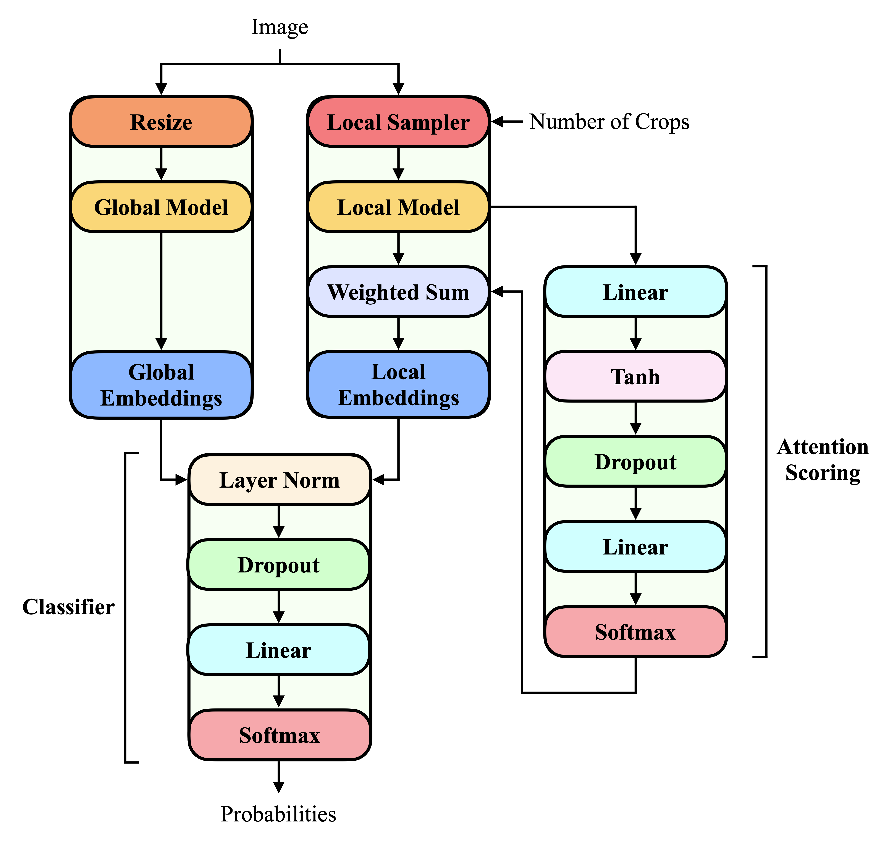

## Attention to Detail: Global-Local Attention for High-Resolution AI-Generated Image Detection

### Description
This repository contains the code for the paper **"Attention to Detail: Global-Local Attention for High-Resolution AI-Generated Image Detection"**. 

<p align="center">
  
</p>

The paper presents **GLASS** (**G**lobal-**L**ocal **A**ttention with **S**tratified **S**ampling), an architecture that combines a globally resized view with multiple randomly sampled local crops. These crops are original resolution regions efficiently selected through spatially stratified sampling and aggregated using
attention-based scoring.

### Project Structure
```text
Attention-To-Detail/
|-- data/                        data downloading, processing, and custom datasets
|-- training/                    training functions
|-- hyperparameter_tuning/       model hyperparmater tuning
|-- model_training/              model training and evaluating
|-- models/                      GLASS and standard models 
|-- num_crops/                   num_crops analysis for GLASS models
|-- standard_memory/             computational resource analysis for standard models
|-- config.py                    global configurations
|-- utils.py                     helper utilities 
|-- README.md                    project overview and documentation
|-- requirements.txt             python package requirements
```

### Setup
1. Clone the repository.
   ```bash
   git clone https://github.com/lawrencehan5/Attention-To-Detail.git
   ```
2. Install packages.
   ```bash
   pip install -r requirements.txt 
   ```
3. Navigate to the project directory.
   ```bash
   cd Attention-To-Detail
   ```
4. Download data.
   ```bash
   python -m data.data_download
   ```
5. Change the directory of the data folder in ```config.py```.
6. Preprocess data.
   ```bash
   python -m data.data_preprocess
   ```

### Running the Code
- Hyperparameter optimization

  Run the line that corresponds to the model you intend to tune.
   ```bash
   python -m hyperparameter_tuning.glass_vit_tuning
   python -m hyperparameter_tuning.glass_convnext_tuning
   python -m hyperparameter_tuning.glass_resnet_tuning

   python -m hyperparameter_tuning.standard_vit_tuning
   python -m hyperparameter_tuning.standard_convnext_tuning
   python -m hyperparameter_tuning.standard_resnet_tuning
   ```
- Train and evaluate models

  Run the line that corresponds to the model you intend to train and evaluate.
   ```bash
   python -m model_training.glass_vit_training
   python -m model_training.glass_convnext_training
   python -m model_training.glass_resnet_training

   python -m model_training.standard_vit_training
   python -m model_training.standard_convnext_training
   python -m model_training.standard_resnet_training
   ```

### Contact
Please feel free to contact me at **lawrence.hanyl@gmail.com** if you have any questions about this project.

